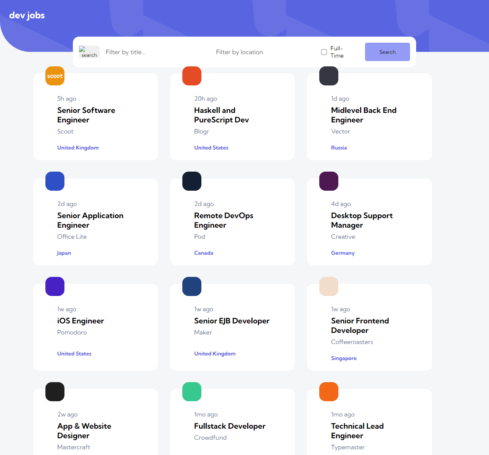

# [Dev Jobs](https://animated-tanuki-96b050.netlify.app/) - Click to view project

Welcome to the Jobs Board project! This is a responsive frontend web application that allows users to view and filter job listings from a local data source. Users can also view job details and apply for the listed positions.

## Features

- Responsive for mobile, tablet and desktop view 
- Filter through job postings based on job title, full-time/part-time and location
- View job details in details page

## Technologies Used

- ReactJs
- CSS

## Screenshots

